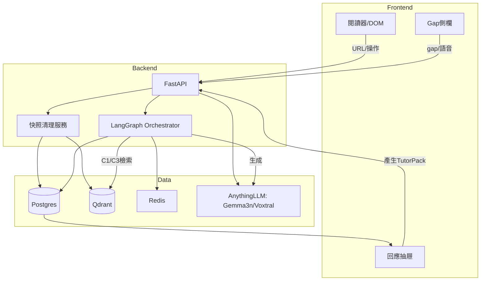
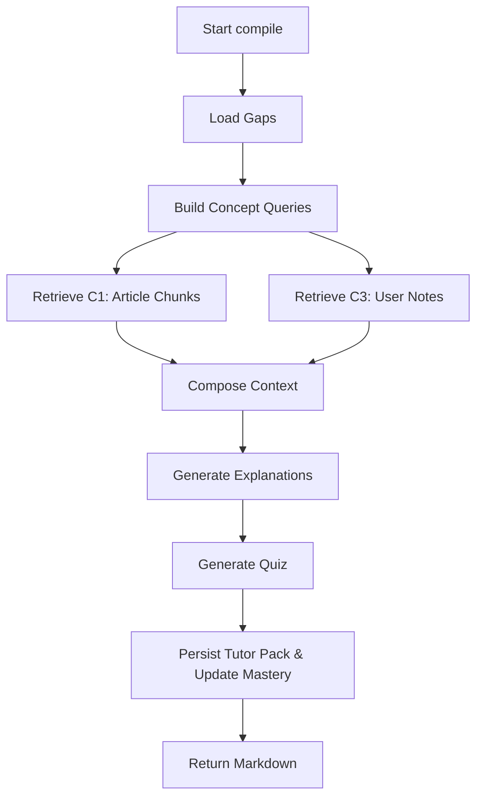

## 0. 背景與定位

- **定位**：單篇技術文章的「學習助教」。從「收藏器」正式轉為「**閱讀→標註→一次彙整教學**」的**非即時**學習產品。
    
- **內容來源（MVP）**：白名單站點（以 Manus 部落格為首批），做 **HTML 快照**供閱讀與翻譯外掛使用。
    
- **核心價值**：工程化上下文，補齊知識缺口，而非長摘要堆疊。
    

## 1. 目標與非目標

**目標**

1. **HTML 快照**：Readability清理，保留 `/<pre><code>/<h*>/<a>`；圖片本地化或 `data:` URI。
    
2. **Gap 標註（非即時）**：框選文字或圖片，以語音／文字寫下困惑與背景。
    
3. **Tutor Pack（批次彙整）**：按下【產生】後，整合三層 Context，輸出**白話講解＋術語卡＋2–3 題小測驗＋原文錨點**，在**可調大小的回應抽屜**渲染（支援 Mermaid）。
    
4. **長期持久化與動態更新**：`unknown→learning→understood` 狀態機；可重跑彙整、版本化保存。
    
5. **本地私有推理**：AnythingLLM 管理模型；**Gemma 3n**（多模態）為主，**Voxtral Mini 3B** 做 ASR 備援。
    

**非目標（MVP 不做）**

- 跨多文章的長對話、全網抽取、多人協作、自研翻譯、即時逐句回覆。
    

## 2. 使用者旅程（例：不懂 SSM/State Space Model）

1. 讀：載入快照（支援瀏覽器翻譯外掛）。
    
2. 標：框選段落→按麥克風口述：_「懂 Transformer，不懂 SSM」_。
    
3. 累積：可標多處名詞／圖示。
    
4. 產生：按【產生 Tutor Pack】。
    
5. 看結果：回應抽屜呈現講解＋測驗＋回指原文；並新增「術語卡」。
    
6. 長期：狀態更新、可重跑彙整、加入複習清單。
    

## 3. 功能需求

### 3.1 快照與分塊

- 非同步抓取→Readability→**乾淨 HTML**；章節／段落分塊（10–15% 重疊）→向量化（Qdrant）。payload：`{article_id, chunk_id, section, heading, source:"article"}`。
    

### 3.2 Gap 標註

- 目標：文字 range / 圖片 bbox。
    
- 輸入：語音→ASR（優先 Voxtral；Gemma 3n 備援）；或純文字。
    
- 正規化：LLM 解析為 `{concept, why_confusing, prior_knowledge, difficulty(1..3)}`；側欄卡片呈現。
    

### 3.3 Tutor Pack（批次彙整）

- **發起**：`POST /tutor/compile {article_id, gap_ids[]?}`。
    
- **三層 Context 整合**：
    
    - **C₁ 文章**：限定 `article_id` 檢索相關塊。
        
    - **C₂ Gap**：把使用者自述與難度作為「教學目標」。
        
    - **C₃ 個人（可選）**：索引 Obsidian 中**親寫**筆記的向量；payload `source:"user-note"`。
        
- **輸出**：Markdown（講解／詞彙／測驗／原文錨點／可含 Mermaid），保存為 `tutor_pack`；並**更新概念狀態**。
    

### 3.4 長期學習與複習

- 間隔重複：`learning` 或久未複習者進入「今日複習」。
    
- 可重跑：任一 gap 可重新產生教學、覆寫新版本。
    

## 4. 系統架構（高階）



## 5. 資料模型（要點）

- `articles(id, url, title, html_snapshot, outline_json, created_at, version)`
    
- `chunks(id, article_id, section, heading, text, token_count)`
    
- `gaps(id, article_id, target_type{"text","image"}, target_range, user_note, concept, difficulty, status{"unknown","learning","understood"}, created_at, updated_at)`
    
- `tutor_packs(id, article_id, gap_ids[], content_md, quiz_json, score_summary, version, created_at)`
    
- **Qdrant payload**：`{article_id, chunk_id?, concept?, source in {"article","user-note"}, section, heading, ts}`
    
- **索引策略**：C₁ 查 `article_id`；C₃ 查 `source:"user-note"`＋`concept`。
    

## 6. API（MVP）

- `POST /ingest {url}` → `{article_id}`（背景做快照/分塊/嵌入）
    
- `POST /gap {article_id, target, user_note?}`（語音先 `/asr`）
    
- `POST /asr`（音訊）→ `{text}`
    
- `POST /tutor/compile {article_id, gap_ids[]?}` → `{tutor_pack_id}`
    
- `GET /tutor/{id}` → Markdown 內容＋錨點
    
- `POST /quiz/{gap_id}/answer {answers}` → `{score, followup}`
    

## 7. 驗收（DoD）

- 10 秒內完成 Manus 快照（含圖）。
    
- 新增一個 Gap：≤ 2 次點擊＋1 次語音；寫庫成功可回看。
    
- 產生 Tutor Pack：≤ 5 秒返回（可調大小抽屜，Mermaid 正常）。
    
- 2 回合內 ≥70% 概念由 `unknown→learning/understood`。
    

## 8. 指標與遙測

- 延遲：`/tutor/compile` P95、ASR 轉寫 P95、檢索召回率。
    
- 學習：概念狀態轉移矩陣、複習留存。
    
- 隱私：全程本地、無外送；模型／向量庫版本可追溯。
    

## 9. 風險與對策

- 抽取失敗→純文降級；ASR 失準→提供文字直輸；模型超時→劣化輸出（僅重點＋錨點）；C₃ 缺資料→僅用 C₁+C₂。
    

## 10. 里程碑（4 週）

W1 快照與向量庫 → W2 閱讀器＋標註／ASR → W3 Orchestrator＋Tutor Pack → W4 狀態機＋複習與 UX 打磨。

---

# 三、為何「RAG 管線」+「LangGraph 編排」？不是「LangGraph 的 chain-of-thought」

- **RAG 是方法**：把「檢索到的證據」+「生成」結合，保證內容可追溯。
    
- **LangGraph 是骨架**：把「擷取→檢索→生成→測驗→保存」做成**狀態圖**與節點，負責**流程與資料流**。
    
- **Chain-of-thought（推理文字）不是流程技術**：那是**模型內部推理文字**；我們不需要、也不應儲存或顯示模型的思考步驟。  
    👉 因此正確描述是：**用 LangGraph 編排「RAG 流程」**，而不是「把資料交給 chain-of-thought」。
    

---

# 四、三層 Context 的實作草圖（可直接套用）

## 4.1 Orchestrator（Mermaid）




## 4.2 節點職責（精簡版）

- **Load Gaps**：讀取本次 `gap_ids[]`，產生概念清單與使用者自述。
    
- **Build Concept Queries**：把每個概念轉為檢索 query（同義詞、縮寫展開）。
    
- **Retrieve C1**：`qdrant.search(filter={"article_id": X})` 只搜本文；回傳帶 `section/heading` 的片段。
    
- **Retrieve C3（可選）**：若使用者開啟個人庫，`filter={"source":"user-note","concept":Y}`。
    
- **Compose Context**：限制總 token；每個概念組合「本文片段 + 使用者自述 +（可選）個人筆記摘要）」。
    
- **Generate Explanations**：提示詞要求**白話＋步驟＋錨點**。
    
- **Generate Quiz**：針對該概念產 2–3 題；附答案／解析。
    
- **Persist**：存 `tutor_packs` 與 `quiz_json`；根據答題分數更新 `gaps.status`。
    

## 4.3 極簡伪代碼（Python + LangGraph 思路）

```python
# 假想介面；示意資料流而非最終 API
from orchestrator import graph, node
from stores import qdrant, pg
from llm import anythingllm

@node
def load_gaps(ctx):
    gaps = pg.get_gaps(ctx.article_id, ctx.gap_ids)
    ctx.concepts = [g.concept for g in gaps]
    ctx.gap_notes = {g.concept: g.user_note for g in gaps}
    return ctx

@node
def retrieve_c1(ctx):
    ctx.c1 = {}
    for c in ctx.concepts:
        ctx.c1[c] = qdrant.search(
            query=c, filter={"article_id": ctx.article_id}, top_k=5)
    return ctx

@node
def retrieve_c3(ctx):
    if not ctx.use_personal:
        ctx.c3 = {}
        return ctx
    ctx.c3 = {}
    for c in ctx.concepts:
        ctx.c3[c] = qdrant.search(
            query=c, filter={"source": "user-note", "concept": c}, top_k=3)
    return ctx

@node
def compose_and_generate(ctx):
    packs = []
    for c in ctx.concepts:
        bundle = {
            "article_evidence": ctx.c1.get(c, []),
            "user_gap": ctx.gap_notes.get(c, ""),
            "personal": ctx.c3.get(c, [])
        }
        md = anythingllm.generate_tutor_markdown(bundle)  # 提示詞內要求白話/步驟/錨點
        quiz = anythingllm.generate_quiz(bundle)
        packs.append((c, md, quiz))
    ctx.tutor_packs = packs
    return ctx

@node
def persist(ctx):
    for c, md, quiz in ctx.tutor_packs:
        pack_id = pg.save_tutor_pack(ctx.article_id, c, md, quiz)
    return {"tutor_pack_id": pack_id}

CompileTutorPack = graph([
    load_gaps, retrieve_c1, retrieve_c3, compose_and_generate, persist
])
```

> 如上：**LangGraph 控流程**、**Qdrant 做檢索**（C₁/C₃）、**LLM 做生成**，**沒有 chain-of-thought 暴露**；而「RAG」只是我們在 `retrieve_* + generate_*` 中採用的**檢索增強生成範式**。

---

## 下一步建議

- 把本回覆中的 **PRD 重寫版**直接存成專案根目錄的 `/docs/PRD_MVP.md`。
    
- 以「W1–W4 里程碑」拆成 issues；先上 **Manus 抽取器＋Qdrant 結構＋/tutor/compile** 的「端到端最小線路」，再補 UX 細節。
    

若你要，我也可以把上面節點拆成實際 **FastAPI + LangGraph + Qdrant** 的最小原型骨架，直接給你程式碼目錄與關鍵檔案。