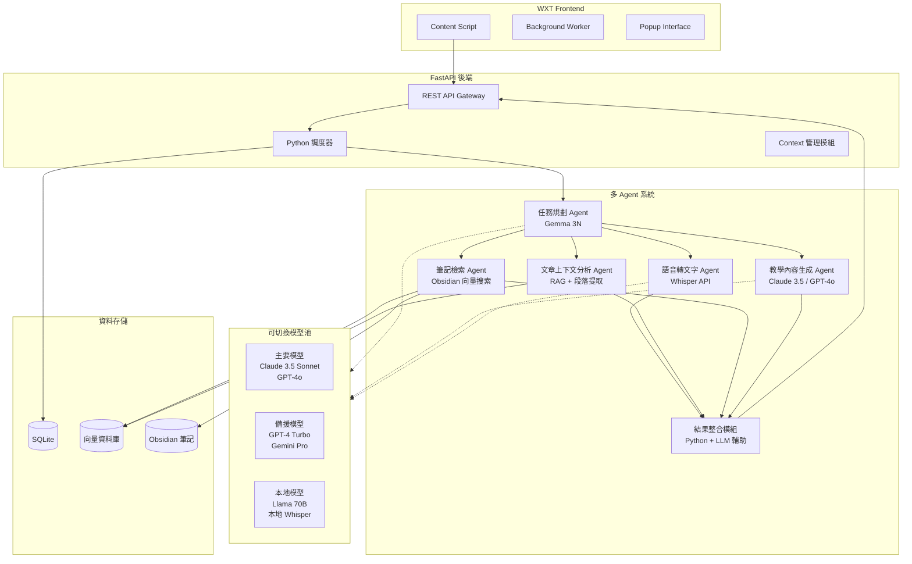
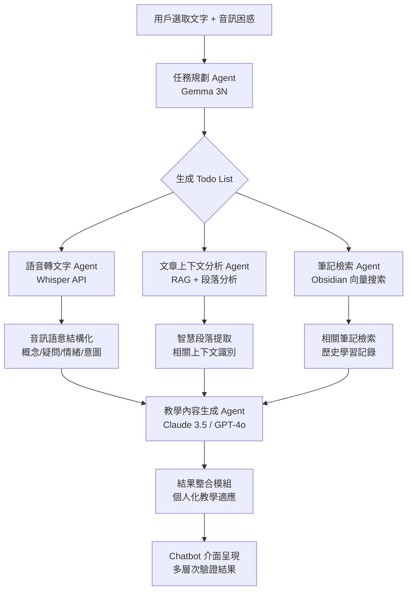
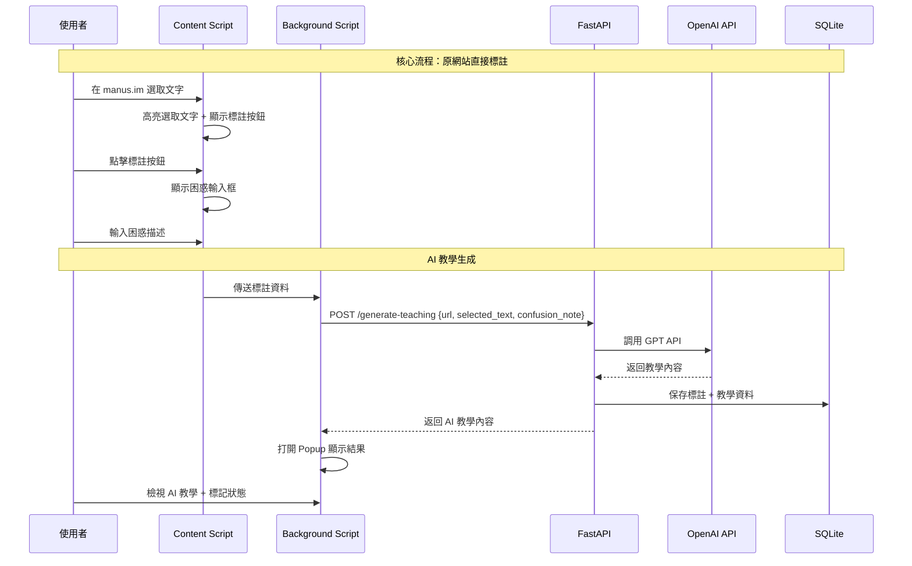

# NodePilot V6 MVP 設計文件

## 概述

NodePilot V6 MVP 是基於 **WXT Framework + React + TypeScript** 的現代化 Chrome 擴充插件，專注驗證「個人化困惑描述 + 文章上下文」比「直接 Google 搜尋」產生更好學習效果的核心價值假設。系統採用 WXT Framework + React 18 + Tailwind CSS 前端架構，搭配 FastAPI 後端和 OpenAI API 整合。核心設計理念是「原網站文字選取→困惑描述→Chatbot 風格 AI 個人化教學」的現代化學習流程。

## MVP 多 Agent 架構設計

### 純 Python 多 Agent LLM 系統架構圖



### 多 Agent 協作流程圖



### MVP 使用者流程



## MVP Chrome Extension 組件設計

### 1. Chrome Extension 組件

#### 1.1 Content Script（含音檔標註功能）
- **職責**：注入標註功能到 manus.im，處理文字選取、標註顯示和音檔錄製
- **介面**：
  ```typescript
  interface ContentScript {
    injectAnnotationFeature(): void
    handleTextSelection(): Promise<SelectionRange>
    showAnnotationButton(range: SelectionRange): void
    showConfusionInput(): void
    showAudioRecordingInterface(): void
    recordAudio(): Promise<AudioBlob>
    transcribeAudio(audio: AudioBlob): Promise<string>
    highlightAnnotatedText(annotationId: string): void
  }
  
  interface SelectionRange {
    startOffset: number
    endOffset: number
    selectedText: string
    pageUrl: string
  }
  
  interface AudioBlob {
    data: Blob
    duration: number
    format: 'webm' | 'mp4'
  }
  ```

#### 1.2 Background Script
- **職責**：處理 API 通信、管理 Extension 狀態
- **介面**：
  ```typescript
  interface BackgroundScript {
    handleAnnotationRequest(data: AnnotationData): Promise<void>
    callTeachingAPI(data: AnnotationData): Promise<TeachingResponse>
    openPopupWithResult(teaching: TeachingResponse): void
    manageExtensionState(): void
  }
  
  interface AnnotationData {
    url: string
    selectedText: string
    confusionNote: string
    audioTranscription?: string
    cognitiveNote?: string
    pageTitle?: string
  }
  
  interface TeachingResponse {
    teachingContent: string
    annotationId: string
    status: 'success' | 'error'
  }
  ```

#### 1.3 Popup Panel
- **職責**：顯示 AI 教學內容、管理學習狀態
- **介面**：
  ```typescript
  interface PopupPanel {
    displayTeachingContent(content: string): void
    showAnnotationHistory(): void
    updateLearningStatus(annotationId: string, status: LearningStatus): void
    renderMarkdown(content: string): void
  }
  
  interface Annotation {
    id: string
    url: string
    selectedText: string
    confusionNote: string
    teachingContent?: string
    status: LearningStatus
    createdAt: Date
  }
  
  enum LearningStatus {
    UNKNOWN = 'unknown',
    LEARNING = 'learning',
    UNDERSTOOD = 'understood'
  }
  ```

### 2. API 路由設計

#### 2.1 核心 API 端點（兩階段設計）
```typescript
// Chrome Extension 專用 API - 分離標註和教學生成
interface ExtensionAPIRoutes {
  // 階段一：立即標註處理
  'POST /annotations': (body: CreateAnnotationRequest) => Promise<AnnotationResponse>
  'POST /upload-audio': (formData: FormData) => Promise<AudioUploadResponse>
  'POST /transcribe-audio': (body: {audio_file_path: string}) => Promise<TranscriptionResponse>
  'POST /generate-cognitive-note': (body: CognitiveNoteRequest) => Promise<CognitiveNoteResponse>
  
  // 階段二：用戶主控教學生成
  'POST /generate-teaching': (body: GenerateTeachingRequest) => Promise<TeachingResponse>
  
  // 標註管理
  'GET /annotations': (params: {url?: string}) => Promise<Annotation[]>
  'PUT /annotations/{id}/status': (id: string, body: {status: LearningStatus}) => Promise<void>
}

// 立即標註請求（支援音檔）
interface CreateAnnotationRequest {
  url: string
  selected_text: string
  confusion_note: string
  audio_file?: File  // 可選音檔
  page_title?: string
}

// 教學生成請求（整合多個困惑點）
interface GenerateTeachingRequest {
  url: string
  annotation_ids: string[]  // 多個困惑點 ID
  page_context?: string     // 文章上下文
}

// 認知記錄生成
interface CognitiveNoteRequest {
  audio_transcription: string
  selected_text: string
  context: string
}
```

### 2. 後端組件

#### 2.1 OpenAI 整合模塊（含 Whisper API）
```typescript
interface OpenAIService {
  generateTeaching(context: TeachingContext): Promise<string>
  createChatCompletion(messages: ChatMessage[]): Promise<string>
  transcribeAudio(audioFile: File): Promise<AudioTranscription>
  generateCognitiveNote(transcription: string, context: string): Promise<string>
}

interface TeachingContext {
  selectedText: string
  confusionNote: string
  audioTranscription?: string
  cognitiveNote?: string
  articleTitle: string
  articleContext?: string
}

interface AudioTranscription {
  text: string
  confidence: number
  language: string
}

interface ChatMessage {
  role: 'system' | 'user' | 'assistant'
  content: string
}
```

#### 2.2 文章抓取模塊
```typescript
interface ArticleScraper {
  fetchArticle(url: string): Promise<ScrapedArticle>
  cleanContent(html: string): Promise<string>
  extractMetadata(html: string): Promise<ArticleMetadata>
}

interface ScrapedArticle {
  title: string
  content: string
  url: string
  metadata: ArticleMetadata
}

interface ArticleMetadata {
  author?: string
  publishDate?: Date
  description?: string
  keywords?: string[]
}
```

### 3. 資料存儲組件

#### 3.1 SQLite 資料存儲
```typescript
interface ArticleRepository {
  saveArticle(article: Article): Promise<string>
  getArticle(id: string): Promise<Article | null>
  listArticles(): Promise<Article[]>
}

interface AnnotationRepository {
  saveAnnotation(annotation: Annotation): Promise<string>
  getAnnotations(articleId: string): Promise<Annotation[]>
  updateAnnotation(id: string, updates: Partial<Annotation>): Promise<void>
  getAnnotation(id: string): Promise<Annotation | null>
}

interface Article {
  id: string
  url: string
  title: string
  content: string
  createdAt: Date
}
```

#### 3.2 API 路由設計
```typescript
// FastAPI 路由定義
interface APIRoutes {
  // 文章相關
  'POST /articles': (body: {url: string}) => Promise<{article_id: string}>
  'GET /articles/{id}': (id: string) => Promise<Article>
  
  // 標註相關
  'POST /annotations': (body: CreateAnnotationRequest) => Promise<{annotation_id: string}>
  'GET /annotations/{articleId}': (articleId: string) => Promise<Annotation[]>
  
  // AI 教學生成
  'POST /generate-teaching': (body: {annotation_id: string}) => Promise<{teaching_content: string}>
}

interface CreateAnnotationRequest {
  article_id: string
  selected_text: string
  confusion_note: string
}
```

## MVP 資料模型

### 核心資料模型

```typescript
// 文章資料模型
interface Article {
  id: string
  url: string
  title: string
  content: string // 清理後的文章內容
  createdAt: Date
}

// 標註模型
interface Annotation {
  id: string
  articleId: string
  selectedText: string // 使用者選取的文字
  confusionNote: string // 使用者的困惑描述
  audioTranscription?: string // Whisper API 轉錄結果
  cognitiveNote?: string // AI 轉換的認知記錄
  generatedTeaching?: string // AI 生成的教學內容
  status: LearningStatus // 學習狀態
  createdAt: Date
  updatedAt: Date
}

enum LearningStatus {
  UNKNOWN = 'unknown',
  LEARNING = 'learning', 
  UNDERSTOOD = 'understood'
}
```

### SQLite 資料庫結構

```sql
-- SQLite 資料表結構
CREATE TABLE articles (
  id TEXT PRIMARY KEY,
  url TEXT NOT NULL UNIQUE,
  title TEXT NOT NULL,
  content TEXT NOT NULL,
  created_at DATETIME DEFAULT CURRENT_TIMESTAMP
);

CREATE TABLE annotations (
  id TEXT PRIMARY KEY,
  article_id TEXT REFERENCES articles(id) ON DELETE CASCADE,
  selected_text TEXT NOT NULL,
  confusion_note TEXT NOT NULL,
  audio_transcription TEXT,
  cognitive_note TEXT,
  generated_teaching TEXT,
  status TEXT DEFAULT 'unknown' CHECK (status IN ('unknown', 'learning', 'understood')),
  created_at DATETIME DEFAULT CURRENT_TIMESTAMP,
  updated_at DATETIME DEFAULT CURRENT_TIMESTAMP
);

-- 索引
CREATE INDEX idx_annotations_article_id ON annotations(article_id);
CREATE INDEX idx_annotations_status ON annotations(status);
```

## MVP 錯誤處理

### 錯誤分類與處理策略

```typescript
enum ErrorType {
  NETWORK_ERROR = 'network_error',
  OPENAI_ERROR = 'openai_error',
  DATABASE_ERROR = 'database_error',
  SCRAPING_ERROR = 'scraping_error'
}

interface ErrorHandler {
  handleError(error: Error, context: ErrorContext): Promise<ErrorResponse>
  shouldRetry(error: Error): boolean
}

interface ErrorResponse {
  success: boolean
  userMessage: string
  shouldRetry: boolean
}
```

### 容錯機制

#### 基礎容錯策略
- 文章抓取失敗 → 提示使用者檢查 URL 或重試
- OpenAI API 失敗 → 顯示錯誤訊息，允許重新生成
- 資料庫錯誤 → 顯示友善錯誤訊息
- 網路超時 → 自動重試機制

## MVP 測試策略

### 單元測試

#### API 端點測試
```typescript
describe('Articles API', () => {
  test('should create article from URL', async () => {
    const response = await request(app)
      .post('/articles')
      .send({ url: 'https://example.com/article' })
    
    expect(response.status).toBe(201)
    expect(response.body).toHaveProperty('article_id')
  })
})

describe('Annotations API', () => {
  test('should create annotation', async () => {
    const response = await request(app)
      .post('/annotations')
      .send({
        article_id: 'test-id',
        selected_text: 'test text',
        confusion_note: 'I don\'t understand this'
      })
    
    expect(response.status).toBe(201)
    expect(response.body).toHaveProperty('annotation_id')
  })
})
```

### 整合測試

#### 端到端工作流測試
```typescript
describe('Learning Workflow', () => {
  test('should complete full learning flow', async () => {
    // 1. 創建文章
    const article = await createArticle(testUrl)
    expect(article).toBeDefined()
    
    // 2. 創建標註
    const annotation = await createAnnotation(article.id, 'selected text', 'confusion')
    expect(annotation).toBeDefined()
    
    // 3. 生成教學內容
    const teaching = await generateTeaching(annotation.id)
    expect(teaching).toBeDefined()
    expect(teaching.length).toBeGreaterThan(0)
  })
})
```

### 效能測試目標

- 文章抓取：< 10 秒
- AI 教學生成：< 15 秒  
- 頁面載入：< 3 秒

## MVP 安全性考量

### 基礎安全措施
- API 密鑰安全管理（環境變數）
- HTTPS 強制使用
- 基礎的輸入驗證和過濾
- SQL 注入防護（使用 ORM）

### 內容安全
- URL 白名單檢查
- 文章內容基礎過濾
- XSS 防護（前端 sanitize）

## MVP 效能優化

### 基礎優化策略
- SQLite 查詢優化
- OpenAI API 呼叫最佳化
- 前端資源壓縮
- 簡單快取機制（內存快取）

## 後續擴展計畫

### 技術升級路線
1. **音檔標註優化** - Voxtral mini 3B 本地音檔理解、音檔暫存優化
2. **純文本閱讀器** - 參考 Readwise OpenReader，網頁內容清理技術
3. **本地 AI 整合** - AnythingLLM + 本地模型
4. **向量搜尋** - Qdrant 整合，改善檢索品質
5. **複雜工作流** - LangGraph 引入，支援多步驟推理
6. **多模態支援** - 圖片標註、進階語音輸入
7. **高級學習功能** - 間隔重複、個人化推薦